<!-- PROJECT LOGO -->
 

  <a href="https://github.com/avenhaus/ESP32_CNC_Pendant">
    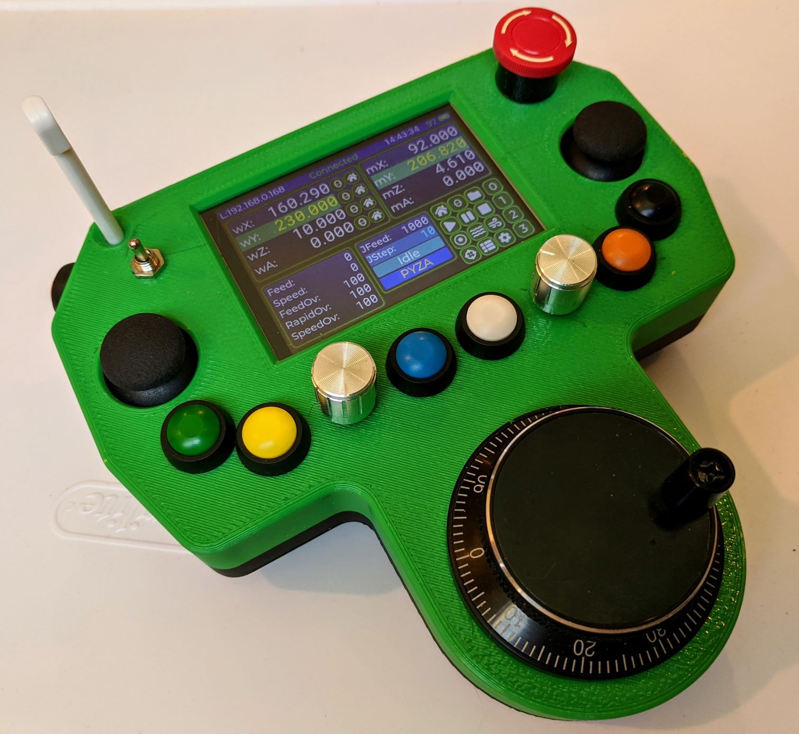
  </a>

<h3 align="center">ESP32 CNC Pendant</h3>

  

    Control your CNC
  

 

  <a href="https://github.com/avenhaus/ESP32_CNC_Pendant">
    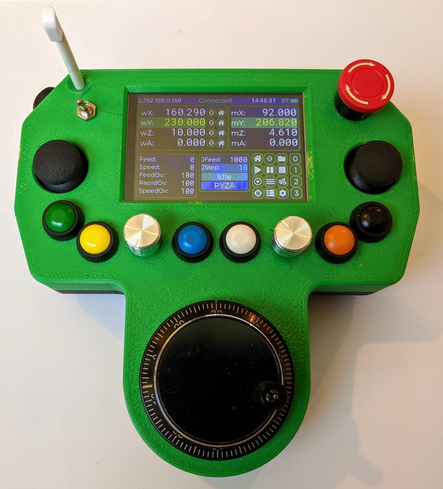
  </a>

<!-- ABOUT THE PROJECT -->
## About The Project

### Project State
This is still a work in progress. 

### Features

* OTA

## Configuration

## TODO

* Documentation
* Access Point
* Wizard
* License

## Links

## Credits

## Screenshots

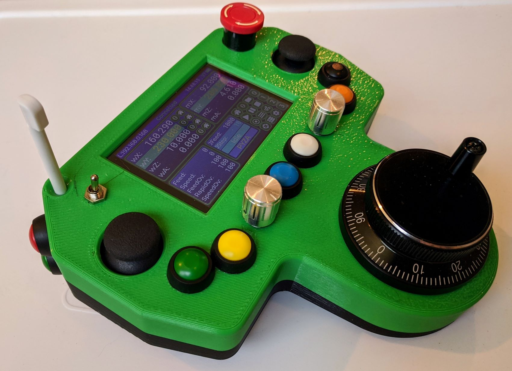

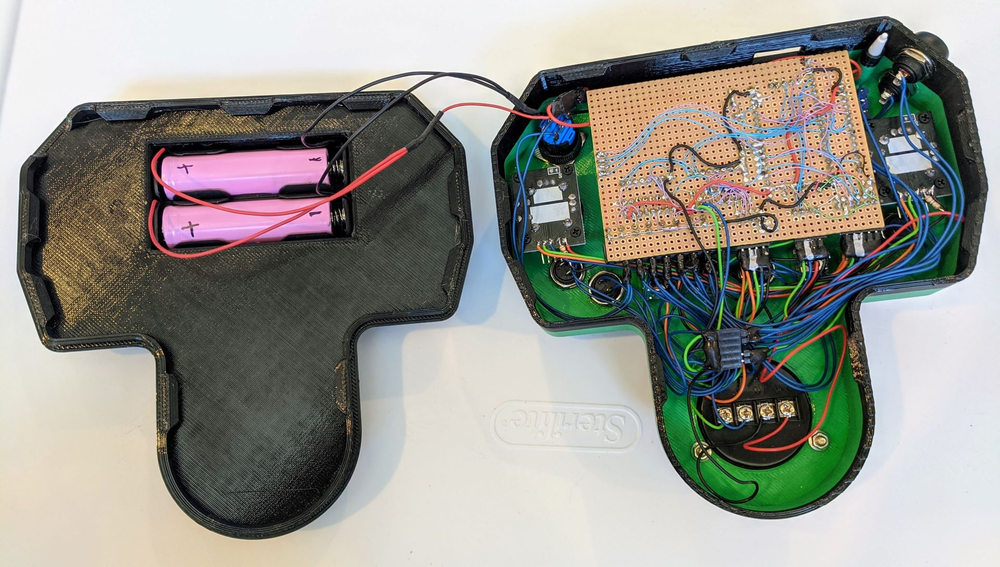
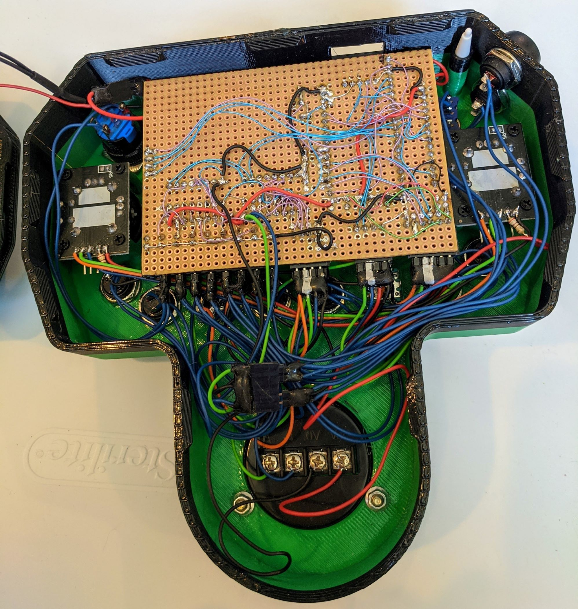
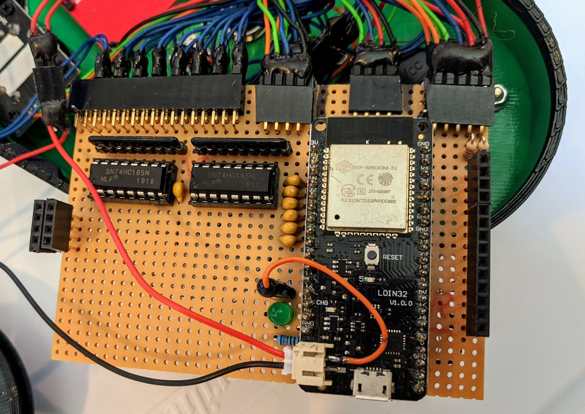
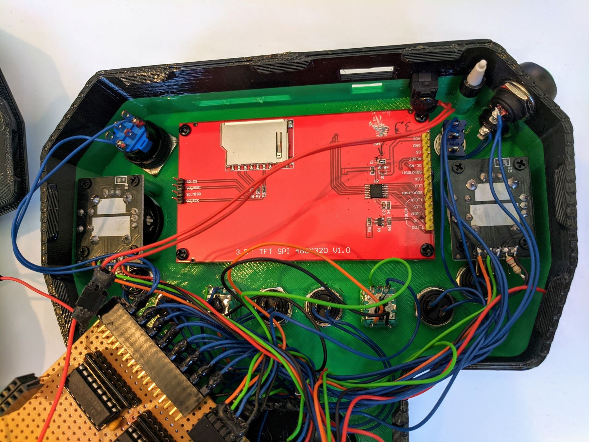
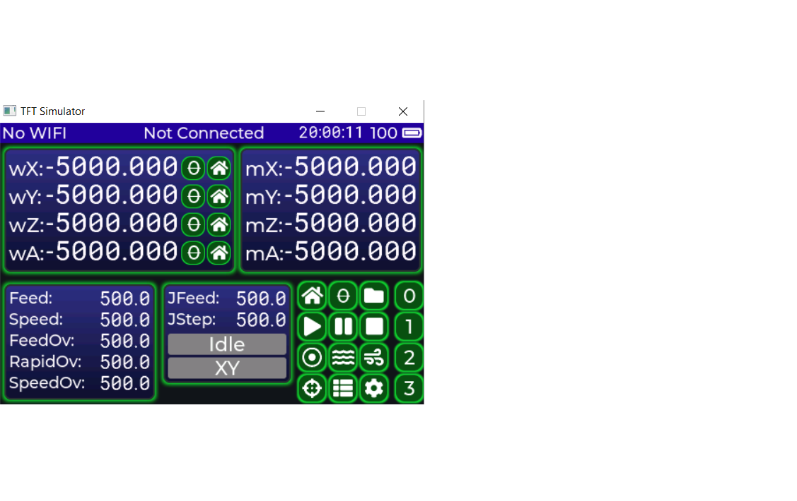
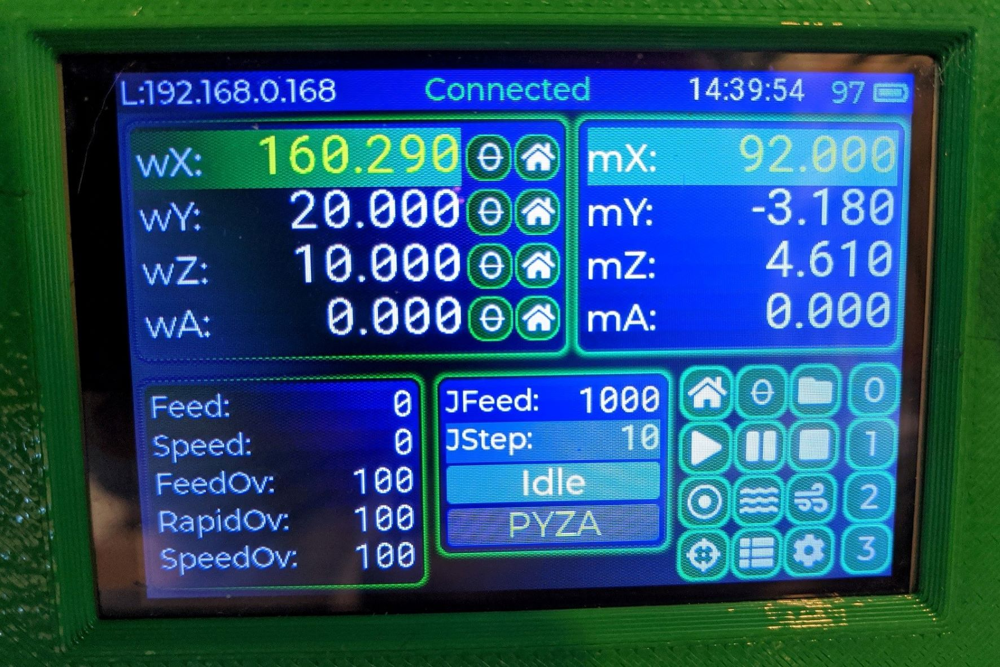
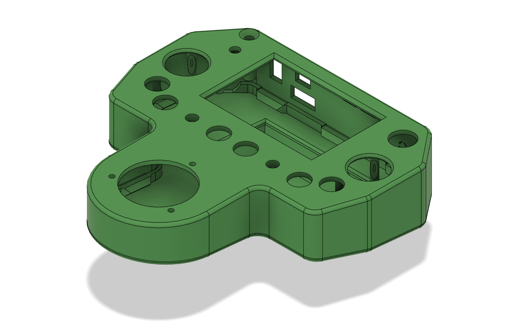
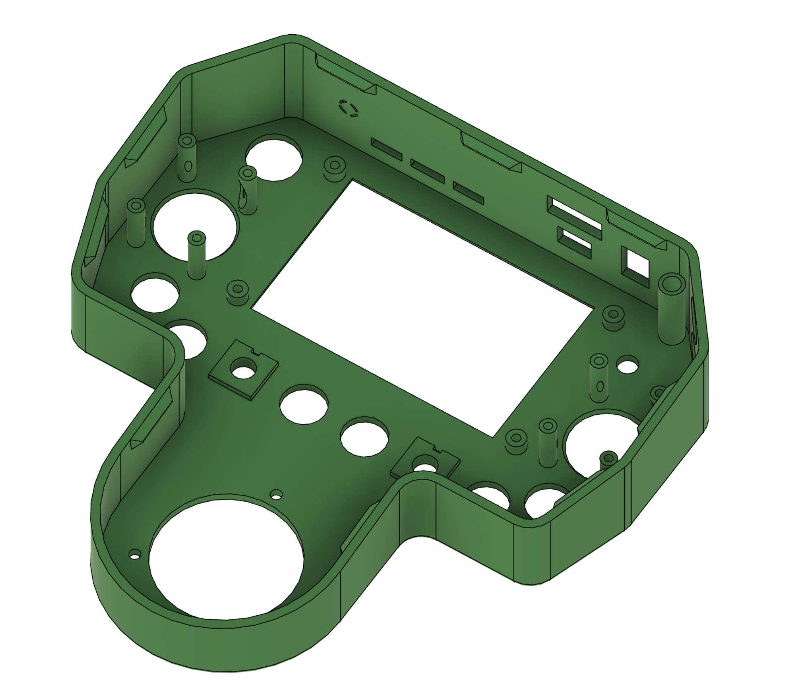
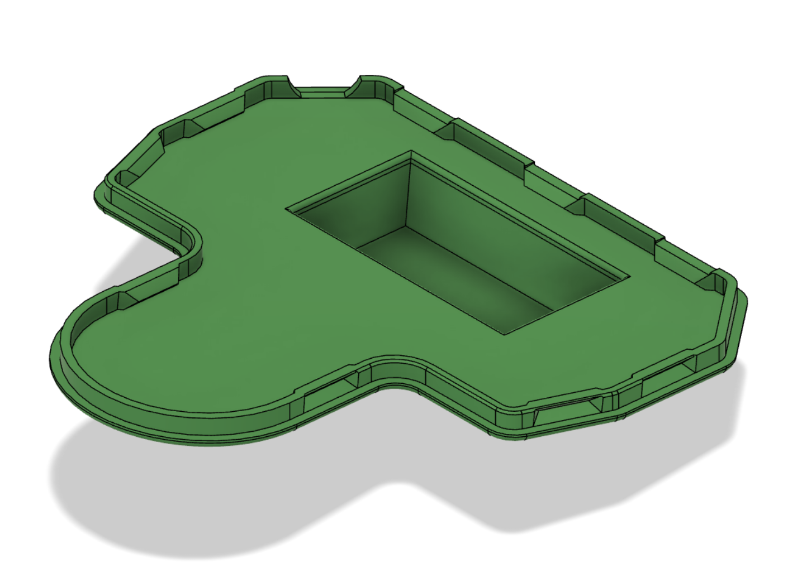
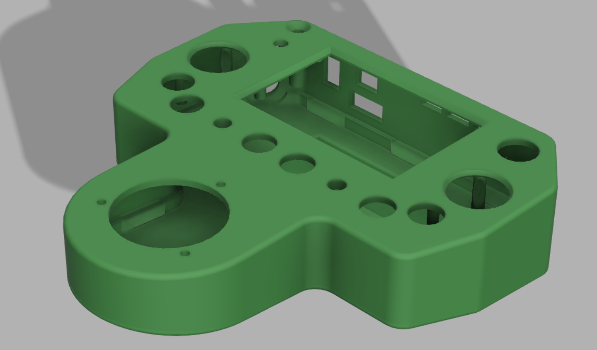

(<a href="#top">back to top</a>)
 
